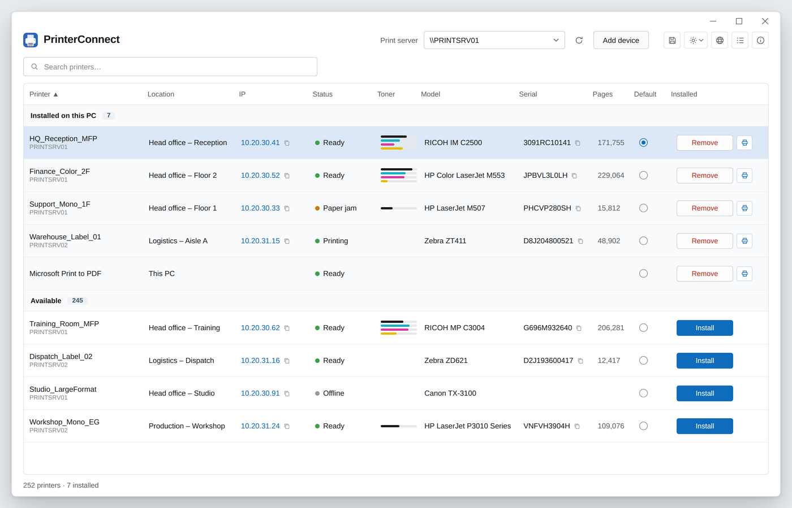

# PrinterConnect

**Free self-service printer tool for Windows 11.** Browse your company print
server, install a printer in one click, see live status, toner levels and IP —
without admin rights, without a support ticket.



## Why this exists

If your users see **"Windows cannot connect to the printer"** with errors
**0x0000011b, 0x0000007c, 0x00000bcb, 0x00000bbb or 0x00000709**, get admin
credential prompts when installing a shared printer, or lost the ability to
browse the print server since the **PrintNightmare** hardening (KB5005565 and
successors, RPC authentication changes, Windows 11 24H2 SMB hardening), you know
the problem: installing a printer from your own print server became a support
ticket.

PrinterConnect gives users a clean self-service list of every printer on your
print server(s): search it, see live status and toner, click to install.
Point-and-Print policies still fully apply — the app never bypasses Windows
security, never elevates, and runs as a standard user.

## Features

- Lists every shared printer from one or more print servers, aggregated
- Instant search (umlaut-tolerant), sortable, resizable, reorderable columns
- Live status (Ready / Printing / Paper jam / Offline …) with direct device
  reachability checks
- Toner and paper-tray levels, model, serial, lifetime page count via read-only
  SNMP (v2c with v1 fallback)
- **Driver type column** — see at a glance which queues are Type 3 (may prompt
  for admin credentials) and which are Type 4 / Protected-Print ready
- One-click install (multi-select supported), remove, default-printer selection
- **Clear print queue** — removes stuck jobs without touching services.msc
- **Print a Windows test page** from any installed printer
- **Export the full inventory to Excel** (.xlsx) — every column, for audits
- Printers installed locally (Print to PDF, OneNote, USB) shown and removable
- Windows 11 look, light/dark/system theme, 14 UI languages, follows the PC language
- Single ~400 KB exe on .NET Framework 4.8 — nothing to install on Windows 11
- Writes nothing to disk except its own settings; no telemetry, no network
  listeners, no elevation (`asInvoker` manifest)

## Download and get started

Grab the latest `PrinterConnect.exe` from
[**Releases**](../../releases/latest), put it anywhere, run it, and enter your
print server (`\\PRINTSERVER`) once. Settings live per user in
`%APPDATA%\PrinterConnect\settings.json`. No installer, no dependencies on
Windows 10/11.

## Deploying in your company

1. **Sign it with your certificate** (recommended — avoids SmartScreen and lets
   you allow-list by publisher):
   ```powershell
   .\deploy\sign.ps1 -ExePath .\PrinterConnect.exe -Thumbprint <YourCertThumbprint>
   ```
   Works with an internal CA cert, an OV/EV cert, or Azure Trusted Signing.
2. **Package for Intune** — see [`deploy/INTUNE.md`](deploy/INTUNE.md).
3. Optionally pre-seed the default print server and column layout by deploying a
   `settings.json` alongside your rollout.

## FAQ

### How can users install printers without admin rights?

Point them at PrinterConnect instead of the Windows "Add printer" dialog. It
enumerates the shared queues on your print server and installs the selected one
with `AddPrinterConnection2`, which is a per-user connection — no elevation, no
local admin group membership. Whether a *driver* can be staged silently is still
decided by your Point-and-Print policy (see the next answer).

### How do I fix "Windows cannot connect to the printer — 0x0000011b"?

That error comes from the PrintNightmare hardening: the client refuses the
server's RPC binding for print-spooler operations. The supported fix is on the
server and policy side — patch both ends, keep `RpcAuthnLevelPrivacyEnabled`
enabled, and move the affected queues to Type 4 / package-aware drivers.
PrinterConnect doesn't patch around the error; it removes the *other* half of
the pain by letting users find and connect working queues themselves, and its
Driver type column shows you exactly which queues still use Type 3 drivers.

### Will users still get admin or "Do you trust this printer?" prompts?

PrinterConnect never bypasses Windows security — installs go through
`AddPrinterConnection2`, so your Point-and-Print policy decides. To make
installs prompt-free for standard users, use Type 4 / package-aware drivers on
the server and set the *Point and Print Restrictions* GPO to your trusted print
servers (see KB5005652). PrinterConnect then gives users the browsing and
one-click experience Microsoft removed.

### Is there a free alternative to PrinterLogic or PaperCut for self-service printing?

For the self-service *install* part, yes — this is it: free, MIT-licensed, no
server component, no agent, no per-seat cost. PrinterConnect does not do print
accounting, secure release printing or driverless cloud printing, which is where
the commercial products earn their money. If all you needed was "let users pick
a printer from the print server themselves", you don't need a platform.

### Do GPO-deployed printers conflict with this?

No — connections made here are the same per-user connections Group Policy
Preferences creates. Many teams use GPO for the mandatory queues and
PrinterConnect for everything self-service.

### How do I clear a stuck print job without admin rights?

Use the ✕ next to the job count, or right-click the printer and choose
*Clear print queue*. With Manage-Documents rights the whole queue is purged; as
a standard user your own jobs are deleted, which Windows always permits. A
spooler that is itself wedged still needs `Restart-Service Spooler` from an
admin — no tool can do that unelevated.

### Why is the download unsigned?

So your company can sign it under its *own* identity: run `deploy\sign.ps1`
with your certificate, allow-list the publisher once in your security tools, and
every future signed build is trusted automatically. Release notes include the
SHA256 of every published binary.

### Does it send any data anywhere?

No. There is no telemetry, no update check, no analytics, and no inbound
listener. SNMP queries go read-only to the printer addresses your print server
reports, and nothing else leaves the machine.

## Building from source

```
dotnet build -c Release   # .NET SDK 8+; EnableWindowsTargeting is set for non-Windows hosts
```

Output: `bin/Release/net48/PrinterConnect.exe`.

## Security posture

- Runs strictly as the invoking user; the manifest forbids elevation
- Printer installs use `AddPrinterConnection2` — Windows' own Point-and-Print
  policy checks fully apply
- SNMP is read-only (community `public`), unicast to known device addresses
- No credentials stored, no inbound sockets, no shell execution of user input

## Changelog

See [CHANGELOG.md](CHANGELOG.md).

## License

MIT — see [LICENSE](LICENSE).

Free software by [ClearVantage.io](https://clearvantage.io) — developer and maintainer.
